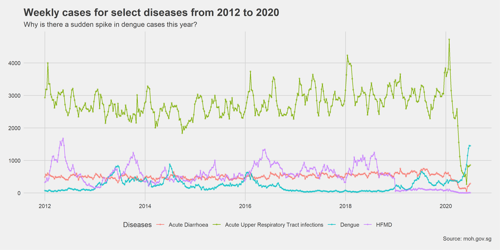
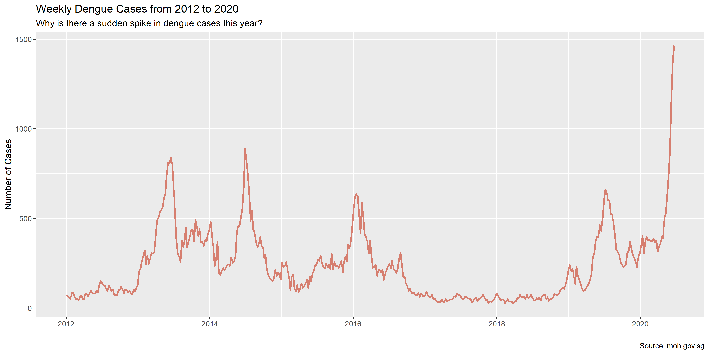

# Analysing Dengue Cases in Singapore

[Preview Current Version of Document](https://roscoelai.github.io/dasr2020capstone/src/capstone_project_html.html)

[Preview Current Version of Leaflet Map](https://roscoelai.github.io/dasr2020capstone/src/capstone_leaflet_html.html)

## Meeting (08 Jul 2020)
### S
- Q1: Case numbers for different diseases across 2012-2020
  - Plot weekly by months for each year - line/bar graph and heat map
  - Compare significant differences between years
- Q2: Weather variables across 2012 - 2020
  - Variables: daily temperature, wind speed, daily total rainfall
  - Aggregate to weekly data - median, mean, min, max, range
  - Plot weekly by months for each year - bar graph and heat map

### A
- Q3: Correlate case numbers and weather variables in general
  - For each disease to each weather variables
  - Which disease is most related to weather
- Q4: Regression model
  - Y (number of cases) = temperature range + e
  - Y (number of cases) = temperature range + total rainfall + e
  - Y (number of cases) = temperature range + total rainfall + humidity + e
- Q5: Identify highest rainfall months and plot the number of cases over the years

### R
- Q7: Compare cases across Singapore regions
  - [x] Geographical plots using Leaflet
  - [x] Leaflet with clusterOptions
  - [ ] Associate cases with climate stations
- Data
  - [x] Filter climate stations based on completeness of data
    - [x] Going with: >3 days/week, >35 weeks/year (except 2020)
    - [x] Down to 10 stations
- R scripts for data import and tidy (and maybe collect... and maybe transform)
  - [x] Tidy MOH weekly bulletin data
  - [x] Import MSS daily weather data
- Spatial Analysis
  - [x] Population
  - [x] Area
  - [x] Number of clinics
  - [ ] Weather
    - [ ] Reintroduce **more** climate stations

### Others
- Q6: Find intervention data (optional)

---

# Capstone Project Proposal

## Overview
Dengue fever is a vector-borne infectious disease that are endemic in the tropical world. Singapore is one of several countries with high disease burden of dengue. In 2020, Singapore saw 1,158 dengue cases in a week of June - the highest number of weekly dengue cases ever recorded since 2014. Why is there a sudden spike in dengue cases this year?

### Questions
  - Does atmospheric variables influence the incidence of dengue cases?
    - Specifically, is higher humidity, precipitation, or temperature associated with increased numbers of dengue cases?
  - Can atmospheric variables predict the number of dengue cases?
  - Does the number of dengue cases increase with the number of COVID-19 cases?
  - Explain the different number of cases in different regions of Singapore

## Data
- [Weekly Infectious Disease Bulletin (2012-W01 to 2020-W27)](https://www.moh.gov.sg/docs/librariesprovider5/diseases-updates/weekly-infectious-disease-bulletin-year-2020301ce94d47e44d24aa16207418a38cff.xlsx), [Ministry of Health (MOH)](https://www.moh.gov.sg/resources-statistics/infectious-disease-statistics/2020/weekly-infectious-diseases-bulletin)
  - Number of cases per week for dengue and other infectious diseases
  - Manually download the latest dataset
- [Historical Daily Records](http://www.weather.gov.sg/climate-historical-daily/), Meteorological Service Singapore (MSS)
  - Daily rainfall
  - Daily temperature and wind speed measurements for some climate stations
  - Automate data collection for selected stations at selected timepoints
- Spatial maps of dengue cases, [Data.gov.sg](https://data.gov.sg)
  - [Central](https://data.gov.sg/dataset/dengue-cases-central)
  - [North East](https://data.gov.sg/dataset/dengue-cases-north-east)
  - [South East](https://data.gov.sg/dataset/dengue-cases-south-east)
  - [South West](https://data.gov.sg/dataset/dengue-cases-south-west)
  - Approximate geocoordinates of cases
  - Manually download the latest datasets
- [Master Plan 2014 Planning Area Boundary (No Sea)](https://data.gov.sg/dataset/master-plan-2014-planning-area-boundary-no-sea), [Data.gov.sg](https://data.gov.sg)
  - Names and sizes of planning areas
  - Manually download dataset
- [Resident Population by Planning Area/Subzone, Age Group and Sex, 2015](https://data.gov.sg/dataset/resident-population-by-planning-area-subzone-age-group-and-sex-2015), [Data.gov.sg](https://data.gov.sg)
  - Populations of planning areas
  - Breakdown by age groups
  - Manually download dataset
- [CHAS Clinics](https://data.gov.sg/dataset/chas-clinics), [Data.gov.sg](https://data.gov.sg)
  - Geocoordinates of CHAS clinics
  - Manually download dataset

### Check this out
- [Resident Population by Planning Area/Subzone and Type of Dwelling, 2015](https://data.gov.sg/dataset/resident-population-by-planning-area-subzone-and-type-of-dwelling-2015), [Data.gov.sg](https://data.gov.sg)

### Unsourceable
- Yearly population distribution across named regions in Singapore
- COVID-19 cases (Apr - Jul 2020)

### Deprecated data
- Monthly Air Temperature And Sunshine, Relative Humidity And Rainfall from [Singapore Department of Statistics (DOS)](https://www.tablebuilder.singstat.gov.sg/publicfacing/api/csv/title/15306.csv)
  - <u>Reason</u>: Higher resolution (daily) data available from MSS
  - Might reconsider if humidity data is needed
- Latest number of cases by named regions in Singapore from [National Environment Agency (NEA)](https://www.nea.gov.sg/dengue-zika/dengue/dengue-clusters)

## Analysis Plan
- Transform dengue cases data
  - Converting epidemiology weeks cases to monthly cases for 2012 - 2020
  - Combine the different Excel sheets into a table 
- Compare the monthly cases across the years
  - Using repeated-measures ANOVA
  - Plotting
- To understand if atmospheric variables have an influence in the incidence of dengue cases
  - Correlate the weather variables with number of dengue cases monthly across the years
- To test if atmospheric variables predict number of dengue cases
  - Create models for regression
  - Compare the predicted value with actual value
- For the current trend, explain the differences between the number of cases in different regions
  - According to the news report, East region has the largest number of clusters than other parts of Singapore
  - In particular, does Marine Parade and Sembawang (or Queenstown?) have any differences in their weather variable?

### Address these
- Time lag: Dengue cases manifest 1-2 weeks after infection
  - Timing adjustments have to be made for ostensibly associated variables
- Seasonal effects
  - "Vector" months (June, July, August, September, October)
- COVID-19 cases vs. dengue cases
  - 90% foreign workers, expect a correlation
  - Compare against number of cases from Apr - Jul 2020

