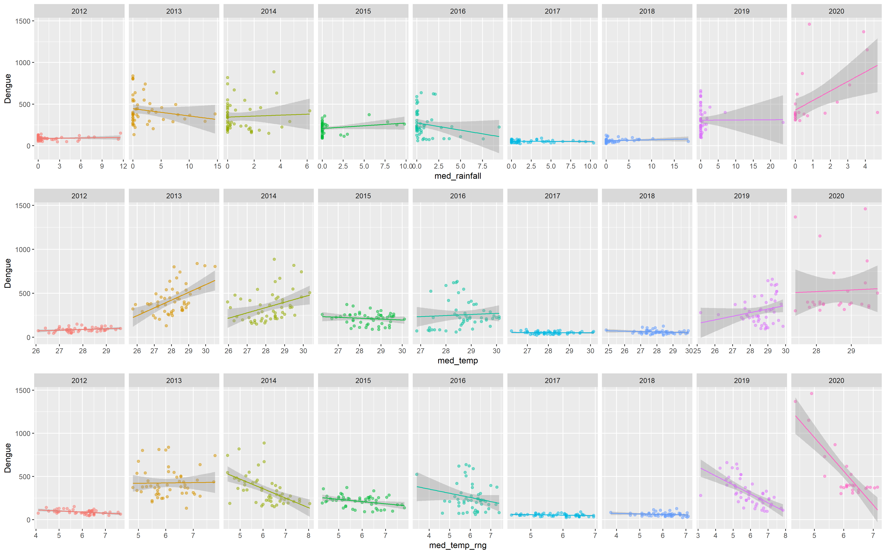
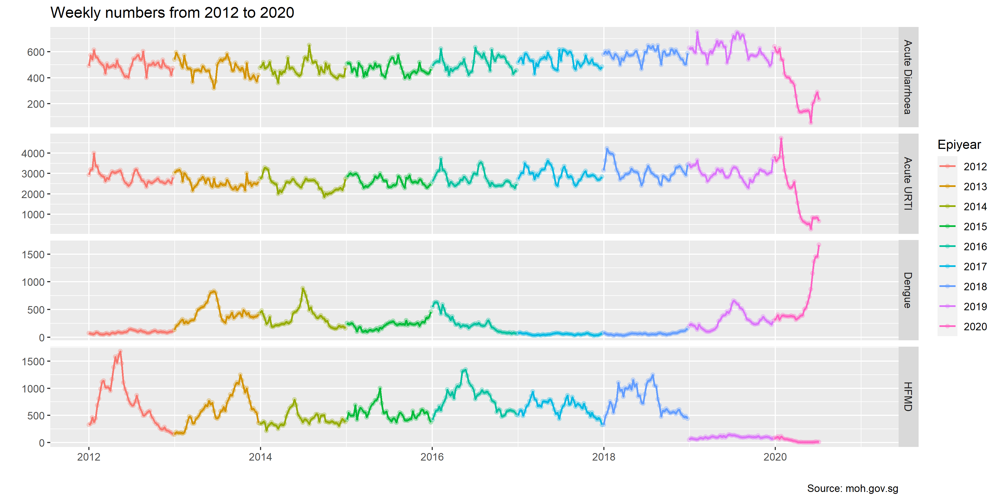

# Analysing Dengue Cases in Singapore

[Preview Current Version of Document](https://roscoelai.github.io/dasr2020capstone/src/capstone_project_html.html)

[Preview Current Version of Leaflet Map](https://roscoelai.github.io/dasr2020capstone/src/capstone_leaflet_html.html)

---

## Meeting (27 Jul 2020) <- ?
### Agenda

#### Reorganize
- [x] Split analyses into time and space
  - [x] [analyze_time.R](https://github.com/roscoelai/dasr2020capstone/blob/master/src/analyze_time.R)
  - [x] [analyze_space.R](https://github.com/roscoelai/dasr2020capstone/blob/master/src/analyze_space.R)
- [x] Purify (remove non-data-collection-related code from) the import-* scripts
- [x] Organize and upload raw data files
  - [x] MOH bulletin
  - [x] MSS station positions
  - [x] HCI webscraping data
  - [x] HCI data with geocodes
- [x] Create and test online option for import_moh_weekly()
- [x] Rename get_geocodes.R to zipcodes_to_geocodes.R and smooth out workflow
- [ ] Create import_kmls.R
- [ ] (Optional) Delete tidied MOH bulletin data

#### Temporal
- [ ] How to aggreagate overall/island-wide meteorological data?
  - [ ] Choose 1 climate station (e.g. Changi)
  - [x] Average climate stations with sufficient data (4 stations)
- [ ] Transform meteorological data
  - [ ] Daily -> Weekly aggregation protocol (mean, median)
- [ ] Combine meteorological and epidemiological data
- [ ] Model meteorological variables vs. number of cases
  - [ ] Time displacement (1 week? 2 weeks?)

#### Spatial
- [ ] How to aggregate recent weather data (13 stations with data for 2020)?
  - [x] Past 1 month?
  - [ ] Past 0.5 month?
  - [ ] Daily -> Weekly aggregation protocol (mean, median, max-min, etc.)
- [x] Combine locality data with:
  - [x] Area
  - [x] Population
  - [x] Dwelling type
  - [x] Number of cases
  - [x] Number of clinics
  - [x] Meteorological data
    - [x] Inverse distance weighted (IDW) from 13 stations
- [ ] Transform number of cases to a fairer indicator (n/area, n/pop, etc.)
  - [ ] Standard choropleth weaknesses:
    - [ ] Modifiable areal unit problem (MAUP)
    - [ ] Ecological fallacy
- [ ] Model everything (?) vs. indicator

---

---

## Meeting (08 Jul 2020)
#### S
- Q1: Case numbers for different diseases across 2012-2020
  - Plot weekly by months for each year - line/bar graph and heat map
  - Compare significant differences between years
- Q2: Weather variables across 2012 - 2020
  - Variables: daily temperature, wind speed, daily total rainfall
  - Aggregate to weekly data - median, mean, min, max, range
  - Plot weekly by months for each year - bar graph and heat map

#### A
- Q3: Correlate case numbers and weather variables in general
  - For each disease to each weather variables
  - Which disease is most related to weather
- Q4: Regression model
  - Y (number of cases) = temperature range + e
  - Y (number of cases) = temperature range + total rainfall + e
  - Y (number of cases) = temperature range + total rainfall + humidity + e
- Q5: Identify highest rainfall months and plot the number of cases over the years

#### R
- Q7: Compare cases across Singapore regions
  - [x] Geographical plots using Leaflet
  - [x] Leaflet with clusterOptions
- R scripts for data import and tidy (and maybe collect... and maybe transform)
  - [x] Tidy MOH weekly bulletin data
  - [x] Import MSS daily weather data
  - [x] Scrape HCI data (+ get coordinates)
- Spatial Analysis
  - [x] Area
  - [x] Population
  - [x] Type of housing
  - [x] Number of clinics
  - [x] Weather (for 2020, 13 stations)

### Others
- Q6: Find intervention data (optional)

---

## Data
- [Weekly Infectious Disease Bulletin, Ministry of Health (MOH)](https://www.moh.gov.sg/resources-statistics/infectious-disease-statistics/2020/weekly-infectious-diseases-bulletin)
  - [Manual download (2012-W01 to 2020-W29) as of 24 Jul 2020](https://www.moh.gov.sg/docs/librariesprovider5/diseases-updates/weekly-infectious-disease-bulletin-year-202071e221d63d4b4be0aa2b03e9c5e78ac2.xlsx)
  - Script for [tidying](https://github.com/roscoelai/dasr2020capstone/blob/master/src/import_moh_weekly.R)
  - [Tidied dataset (2012-W01 to 2020-W29) as of 24 Jul 2020](https://raw.githubusercontent.com/roscoelai/dasr2020capstone/master/data/moh_weekly_bulletin_20200724.csv)
- [Historical Daily Records, Meteorological Service Singapore (MSS)](http://www.weather.gov.sg/climate-historical-daily/)
  - Daily rainfall
  - Daily temperature and wind speed measurements for some climate stations
  - Script for [webscraping](https://github.com/roscoelai/dasr2020capstone/blob/master/src/import_mss_daily.R)
  - [Tidied subset (2012-2020)](https://raw.githubusercontent.com/roscoelai/dasr2020capstone/master/data/mss_daily_2012_2020_4stations_20200714.csv)
  - [Tidied subset (2020)](https://raw.githubusercontent.com/roscoelai/dasr2020capstone/master/data/mss_daily_2020_13stations_20200722.csv)
- [Listing of Licensed Healthcare Institutions, Ministry of Health (MOH)](http://hcidirectory.sg/hcidirectory/)
  - Name and address of HCI
  - Scripts for [webscraping](https://github.com/roscoelai/dasr2020capstone/blob/master/src/import_hcidirectory.R) and [deriving coordinates](https://github.com/roscoelai/dasr2020capstone/blob/master/src/get_geocodes.R)
- [Approximate geocoordinates of dengue cases](https://data.gov.sg/search?q=denguecases), Data.gov.sg

| Date       | Central     | North East  | South East  | South West  |
| :--------: | :---------: | :---------: | :---------: | :---------: |
| 2020-06-26 | [.kml][c1]  | [.kml][c2]  | [.kml][c3]  | [.kml][c4]  |
| 2020-07-07 | [.kml][c5]  | [.kml][c6]  | [.kml][c7]  | [.kml][c8]  |
| 2020-07-09 | [.kml][c9]  | [.kml][c10] | [.kml][c11] | [.kml][c12] |
| 2020-07-15 | [.kml][c13] | [.kml][c14] | [.kml][c15] | [.kml][c16] |
| 2020-07-17 | [.kml][c17] | [.kml][c18] | [.kml][c19] | [.kml][c20] |

[c1]: https://geo.data.gov.sg/denguecase-central-area/2020/06/26/kml/denguecase-central-area.kml
[c2]: https://geo.data.gov.sg/denguecase-northeast-area/2020/06/26/kml/denguecase-northeast-area.kml
[c3]: https://geo.data.gov.sg/denguecase-southeast-area/2020/06/26/kml/denguecase-southeast-area.kml
[c4]: https://geo.data.gov.sg/denguecase-southwest-area/2020/06/26/kml/denguecase-southwest-area.kml
[c5]: https://geo.data.gov.sg/denguecase-central-area/2020/07/07/kml/denguecase-central-area.kml
[c6]: https://geo.data.gov.sg/denguecase-northeast-area/2020/07/07/kml/denguecase-northeast-area.kml
[c7]: https://geo.data.gov.sg/denguecase-southeast-area/2020/07/07/kml/denguecase-southeast-area.kml
[c8]: https://geo.data.gov.sg/denguecase-southwest-area/2020/07/07/kml/denguecase-southwest-area.kml
[c9]: https://geo.data.gov.sg/denguecase-central-area/2020/07/09/kml/denguecase-central-area.kml
[c10]: https://geo.data.gov.sg/denguecase-northeast-area/2020/07/09/kml/denguecase-northeast-area.kml
[c11]: https://geo.data.gov.sg/denguecase-southeast-area/2020/07/09/kml/denguecase-southeast-area.kml
[c12]: https://geo.data.gov.sg/denguecase-southwest-area/2020/07/09/kml/denguecase-southwest-area.kml
[c13]: https://geo.data.gov.sg/denguecase-central-area/2020/07/15/kml/denguecase-central-area.kml
[c14]: https://geo.data.gov.sg/denguecase-northeast-area/2020/07/15/kml/denguecase-northeast-area.kml
[c15]: https://geo.data.gov.sg/denguecase-southeast-area/2020/07/15/kml/denguecase-southeast-area.kml
[c16]: https://geo.data.gov.sg/denguecase-southwest-area/2020/07/15/kml/denguecase-southwest-area.kml
[c17]: https://geo.data.gov.sg/denguecase-central-area/2020/07/17/kml/denguecase-central-area.kml
[c18]: https://geo.data.gov.sg/denguecase-northeast-area/2020/07/17/kml/denguecase-northeast-area.kml
[c19]: https://geo.data.gov.sg/denguecase-southeast-area/2020/07/17/kml/denguecase-southeast-area.kml
[c20]: https://geo.data.gov.sg/denguecase-southwest-area/2020/07/17/kml/denguecase-southwest-area.kml

- [Approximate geocoordinates of _Aedes_ mosquito breeding habitats](https://data.gov.sg/search?q=aedes+habitats), Data.gov.sg

Date       | Central     | North East  | North West  | South East  | South West 
:--------: | :---------: | :---------: | :---------: | :---------: | :---------:
2020-07-14 | [.kml][h1]  | [.kml][h2]  | [.kml][h3]  | [.kml][h4]  | [.kml][h5] 
2020-07-17 | [.kml][h6]  | [.kml][h7]  | [.kml][h8]  | [.kml][h9]  | [.kml][h10]

[h1]: https://geo.data.gov.sg/breedinghabitat-central-area/2020/07/14/kml/breedinghabitat-central-area.kml
[h2]: https://geo.data.gov.sg/breedinghabitat-northeast-area/2020/07/14/kml/breedinghabitat-northeast-area.kml
[h3]: https://geo.data.gov.sg/breedinghabitat-northwest-area/2020/07/14/kml/breedinghabitat-northwest-area.kml
[h4]: https://geo.data.gov.sg/breedinghabitat-southeast-area/2020/07/14/kml/breedinghabitat-southeast-area.kml
[h5]: https://geo.data.gov.sg/breedinghabitat-southwest-area/2020/07/14/kml/breedinghabitat-southwest-area.kml
[h6]: https://geo.data.gov.sg/breedinghabitat-central-area/2020/07/17/kml/breedinghabitat-central-area.kml
[h7]: https://geo.data.gov.sg/breedinghabitat-northeast-area/2020/07/17/kml/breedinghabitat-northeast-area.kml
[h8]: https://geo.data.gov.sg/breedinghabitat-northwest-area/2020/07/17/kml/breedinghabitat-northwest-area.kml
[h9]: https://geo.data.gov.sg/breedinghabitat-southeast-area/2020/07/17/kml/breedinghabitat-southeast-area.kml
[h10]: https://geo.data.gov.sg/breedinghabitat-southwest-area/2020/07/17/kml/breedinghabitat-southwest-area.kml

- [Singapore Residents by Planning Area and Type of Dwelling, Jun 2017](https://data.gov.sg/dataset/singapore-residents-by-planning-area-and-type-of-dwelling-jun-2017), Data.gov.sg
  - Planning areas (URA MP14)
  - Populations of planning areas
  - Breakdown by type of dwelling
  - [.kml file](https://geo.data.gov.sg/plan-bdy-dwelling-type-2017/2017/09/27/kml/plan-bdy-dwelling-type-2017.kml)

### Unsourceable
- COVID-19 cases (Apr - Jul 2020)

### Deprecated
- [Monthly Air Temperature And Sunshine, Relative Humidity And Rainfall, Singapore Department of Statistics (DOS)](https://www.tablebuilder.singstat.gov.sg/publicfacing/initApiList.action)
  - Higher resolution (daily) data available from MSS
  - Might reconsider if humidity data is needed
  - [.csv file](https://www.tablebuilder.singstat.gov.sg/publicfacing/api/csv/title/15306.csv)
- [Master Plan 2014 Planning Area Boundary (No Sea)](https://data.gov.sg/dataset/master-plan-2014-planning-area-boundary-no-sea), Data.gov.sg
  - Names and sizes of planning areas
  - [.zip file](https://geo.data.gov.sg/mp14-plng-area-no-sea-pl/2016/05/11/kml/mp14-plng-area-no-sea-pl.zip)
- [Resident Population by Planning Area/Subzone and Type of Dwelling, 2015](https://data.gov.sg/dataset/resident-population-by-planning-area-subzone-and-type-of-dwelling-2015), Data.gov.sg
  - Populations of planning areas
  - Breakdown by type of dwelling
  - [.csv file](https://storage.data.gov.sg/resident-population-by-planning-area-subzone-and-type-of-dwelling-2015/resources/resident-population-by-planning-area-and-type-of-dwelling-2020-07-15T06-05-58Z.csv)
- [Resident Population by Planning Area/Subzone, Age Group and Sex, 2015](https://data.gov.sg/dataset/resident-population-by-planning-area-subzone-age-group-and-sex-2015), Data.gov.sg
  - Populations of planning areas
  - Breakdown by age groups
  - [.csv file](https://storage.data.gov.sg/resident-population-by-planning-area-subzone-age-group-and-sex-2015/resources/resident-population-by-planning-area-age-group-and-sex-2019-07-30T03-02-18Z.csv)
- [CHAS Clinics](https://data.gov.sg/dataset/chas-clinics), Data.gov.sg
  - Geocoordinates of CHAS clinics
  - [.kml file](https://geo.data.gov.sg/moh-chas-clinics/2020/07/05/kml/moh-chas-clinics.kml)

---

# Capstone Project Proposal

## Overview
Dengue fever is a vector-borne infectious disease that are endemic in the tropical world. Singapore is one of several countries with high disease burden of dengue. In 2020, Singapore saw 1,158 dengue cases in a week of June - the highest number of weekly dengue cases ever recorded since 2014. Why is there a sudden spike in dengue cases this year?

### Questions
  - Does atmospheric variables influence the incidence of dengue cases?
    - Specifically, is higher humidity, precipitation, or temperature associated with increased numbers of dengue cases?
  - Can atmospheric variables predict the number of dengue cases?
  - Does the number of dengue cases increase with the number of COVID-19 cases?
  - Explain the different number of cases in different regions of Singapore

## <s>Data</s>
(Moved)

## Analysis Plan
- Transform dengue cases data
  - Converting epidemiology weeks cases to monthly cases for 2012 - 2020
  - Combine the different Excel sheets into a table 
- Compare the monthly cases across the years
  - Using repeated-measures ANOVA
  - Plotting
- To understand if atmospheric variables have an influence in the incidence of dengue cases
  - Correlate the weather variables with number of dengue cases monthly across the years
- To test if atmospheric variables predict number of dengue cases
  - Create models for regression
  - Compare the predicted value with actual value
- For the current trend, explain the differences between the number of cases in different regions
  - According to the news report, East region has the largest number of clusters than other parts of Singapore
  - In particular, does Marine Parade and Sembawang (or Queenstown?) have any differences in their weather variable?

### Address
- Time lag: Dengue cases manifest 1-2 weeks after infection
  - Timing adjustments have to be made for ostensibly associated variables
- Seasonal effects
  - "Vector" months (June, July, August, September, October)
- COVID-19 cases vs. dengue cases
  - 90% foreign workers, expect a correlation
  - Compare against number of cases from Apr - Jul 2020

---
